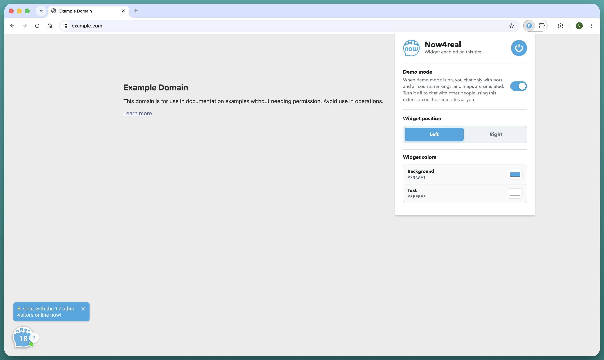

# Now4real Everywhere

**Try the Now4real widget on a website that has not integrated it yet.**

Now4real Everywhere is a Google Chrome extension that temporarily adds the Now4real chat widget to websites you visit. It is designed for anyone who wants to try the widget experience on their own website, or in an environment where they are authorized to run tests, before proceeding with an integration.

The extension is active only on domains that you explicitly enable, and can be turned off at any time.

## What you can do

- Enable the Now4real widget for a specific website.
- Try the widget in **demo mode**, with bots and simulated data.
- Turn off demo mode to experience the widget with other people using this extension on the same websites.
- Choose whether the widget appears on the left or right side of the page.
- Customize the widget background and text colors for each website.
- Keep preferences separate for every domain.

## Install locally in Chrome

The extension does not require a build step or dependency installation. Once you have downloaded the project, you can load it directly in Chrome.

1. Download the project from GitHub using **Code → Download ZIP**, then extract the archive; alternatively, clone the repository.
2. In Chrome, open [chrome://extensions](chrome://extensions).
3. Enable **Developer mode** in the top-right corner.
4. Select **Load unpacked**.
5. Select the project's root folder: the folder that contains `manifest.json`.
6. If needed, pin **Now4real Everywhere** to the Chrome toolbar from the Extensions menu.

The extension will appear in Chrome's extension list and remain available until you disable or remove it.

## Try it on a website

1. Open the page of the website you want to test in Chrome.
2. Select the **Now4real Everywhere** icon in the toolbar.
3. Turn on the main switch to enable the widget for that website.
4. The page will refresh and the widget will appear in the selected position.

For your first test, leave **demo mode** enabled: you can interact with bots and see simulated data without involving real users. Changes to the settings automatically refresh the current page.

To stop testing, open the extension panel again and turn off the switch. This setting applies only to the current website; other websites will not be changed.

## Privacy

The extension stores its settings locally in Chrome. When Chrome Sync is enabled, the widget status, demo-mode preference, position, and color choices are synchronized through your Chrome profile and are associated with the website's domain. Temporary messages about whether a website blocks the widget are stored only on the device.

This extension does not contain code that sends these settings to a Now4real-operated backend. However, when you enable the widget, it loads the Now4real script from the Now4real CDN. Your use of the widget and any information you provide through it are subject to Now4real's applicable privacy terms.

## Important notes

- The extension works on standard HTTP and HTTPS web pages. It cannot run on Chrome internal pages, the Chrome Web Store, or other browser-protected contexts.
- If a website blocks third-party scripts through a particularly restrictive Content Security Policy, the widget may not load. In this case, the extension displays a warning and does not alter the page.
- If the website already integrates Now4real, the extension detects the existing widget and does not add a second one.
- Preferences are saved through Chrome Sync and associated with the domain you visit.

## Remove the extension

Open [chrome://extensions](chrome://extensions), find **Now4real Everywhere**, and select **Remove**. Alternatively, use the switch on the same page to disable it temporarily.

## Contributing

Bug reports and improvement proposals are welcome through the repository's issues and pull requests.

The project's maintenance scripts are intended for extension development and are not required for local installation.
